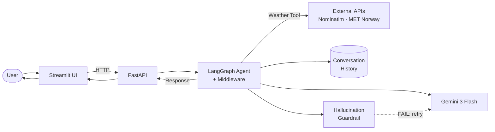
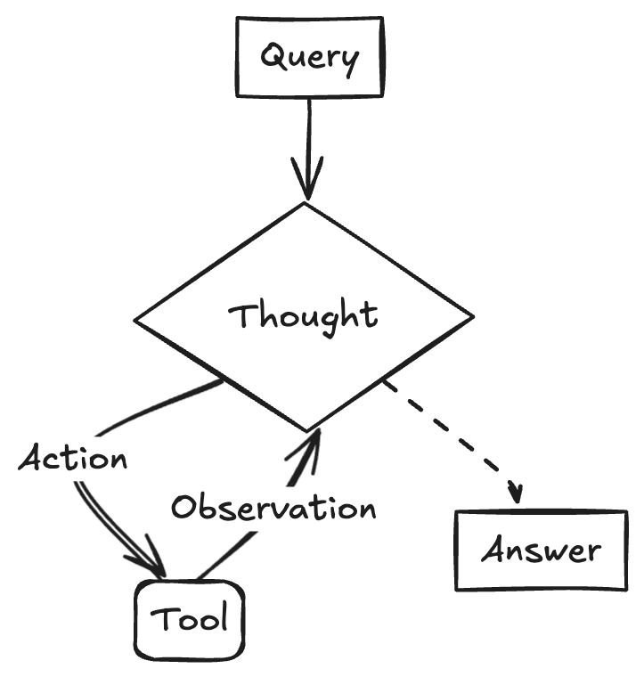

# Ava - Travel Assistant

An AI-powered travel assistant built on the **ReAct (Reason + Act) pattern** using **LangGraph**, **LangChain**, and **Google Gemini**. The agent reasons about the user's query, decides whether to act by calling external tools, observes the results, and then formulates a grounded response — all enhanced by a middleware pipeline for tool selection, retry logic, and hallucination detection.

## System Design



### ReAct Loop

<p align="center">
  
</p>


**Components:**
- **Frontend**: Streamlit chat interface with optional debug trace panel (`streamlit_app.py`)
- **Backend**: FastAPI server with `/completions` endpoint (`app/main.py`)
- **Agent**: LangGraph agent with `InMemorySaver` checkpointer and middleware pipeline (`app/agent.py`)
- **LLM**: Google Gemini 3 Flash Preview (free tier)

## Quick Start

**Prerequisites:** Python 3.12+

```bash
# 1. Install dependencies
pip install -r requirements.txt

# 2. Set your Google API key
export GOOGLE_API_KEY="your-key-here"

# 3. Run (starts both backend + frontend)
bash run.sh
```

The app will be available at `http://localhost:8501`.

---

## How Each Requirement Is Fulfilled

### 1. Conversation Quality — Natural, Helpful Interactions

**Three travel query types** are explicitly defined in the system prompt (`app/prompts/system_prompt.py`):
1. **Destination recommendations** — where to go, how long to stay
2. **Packing advice** — weather-aware, grouped by category
3. **Local attractions / itineraries** — matched to interests and available time

Each type has its own section in the prompt with specific behavioral rules (e.g., "do NOT list attractions in the destination step", "start packing advice with a one-line strategy summary").

**Follow-ups and natural flow** are handled through:
- A conversational tone directive: *"Be conversational and natural; maintain context from previous messages"*
- A structured response format (summary → options → assumptions → one follow-up question) that keeps exchanges focused
- A rule to ask at most 1–3 clarifying questions — never interrogate

### 2. Prompt Engineering

**System prompt** (`app/prompts/system_prompt.py`) — 108-line structured prompt with sections for: core capabilities, conversation principles, response format, tool policy, accuracy rules, multi-step reasoning, per-query-type rules, and guardrails.

**Chain-of-thought** — The `MULTI-STEP REASONING (INTERNAL)` section instructs the model to follow a 5-step hidden reasoning process for every request:
1. Identify intent (destination vs. packing vs. attractions)
2. Extract constraints, identify missing info
3. Decide if a tool call is needed
4. Generate 2–4 options with trade-offs
5. Produce the user-facing answer

The model is explicitly told: *"Do NOT reveal your internal steps, hidden reasoning, or chain-of-thought."*

**Concise responses** — enforced via: *"Be concise and practical. Prefer short paragraphs and bullet points. Avoid unnecessary fluff."*

### 3. Data Augmentation — External APIs + Decision Method

**External APIs** (no API keys required):
- **OpenStreetMap Nominatim** — geocoding (city name → coordinates)
- **MET Norway LocationForecast 2.0** — 7-day weather forecast

Implemented in `app/tools/external/weather.py` as a LangChain `@tool` that returns structured Pydantic JSON.

**When to call external data vs. rely on the LLM** — decided by an **LLM-based tool selector** (`app/middleware/tool_selector.py`). Before each model call, a separate classifier LLM evaluates the user's message against three criteria defined in `app/prompts/tool_selector_prompt.py`:

> Return `["get_weather_forecast"]` ONLY when ALL of these are true:
> 1. The user mentions a specific location
> 2. The travel dates fall within the next 7 days (date dynamically injected)
> 3. The user explicitly needs weather data

Everything else → `[]` (answer from LLM knowledge alone).

**Blending external data with LLM knowledge** — the system prompt instructs: *"When external data (like weather) is provided, integrate it directly into your advice."* If a tool fails, the model is told to acknowledge the failure and fall back to general seasonal guidance.

### 4. Error Handling — Recovering from Hallucinations and Failures

**Six layers of error handling**, from innermost to outermost:

| Layer | File | What It Does |
|-------|------|-------------|
| **Tool-level** | `weather.py` | Catches timeouts, bad locations, unexpected errors. Always returns structured `{ok: false, error: "..."}` — never throws to the LLM. |
| **Retry (model)** | `retry.py` | Exponential backoff with jitter (up to 3 attempts) for transient LLM API failures. |
| **Retry (tool)** | `retry.py` | Same pattern for tool calls (up to 2 attempts). |
| **Hallucination guardrail** | `hallucination_guardrail.py` | Post-model: a **separate verifier LLM** checks if the response is grounded in tool data and facts. On failure, injects a corrective `[SYSTEM: ...]` message and re-routes to the model for re-generation (max 1 retry). |
| **API-level** | `main.py` | Catches unhandled exceptions, returns a user-friendly 500 error. |
| **UI-level** | `streamlit_app.py` | Handles connection errors, timeouts, and HTTP errors gracefully in the chat. |

**Hallucination guardrail flow** (the key differentiator):
1. After the model produces a final text response, the guardrail extracts all tool observations and conversation context
2. A verifier LLM evaluates the response against a grounding check prompt (`app/prompts/grounding_check_prompt.py`) — checking for fabricated weather data, invented specifics, or ignored tool errors
3. Verdict is `PASS` or `FAIL: <reason>`
4. On `FAIL`: a corrective message is injected and the agent re-generates. On `PASS`: response is delivered as-is

### 5. Context Management — Conversation History

Handled by **LangGraph's `InMemorySaver` checkpointer** (`app/agent.py`):
- Each Streamlit session gets a unique `thread_id` (UUID)
- Every request includes the `thread_id`, and the checkpointer automatically loads + appends the full message history
- The model sees all prior messages in the thread, enabling natural follow-ups and constraint revisions
- "New chat" in the UI resets the `thread_id`, starting a fresh conversation

---

## Key Prompt Engineering Decisions

1. **Hidden chain-of-thought** — The model reasons through a structured 5-step process internally but only outputs the final answer. This improves consistency without cluttering responses.

2. **Per-query-type rules** — Within the single system prompt, each travel query type (destinations, packing, attractions) has its own dedicated section with specific behavioral constraints. This prevents common failure modes like listing attractions during a destination recommendation.

3. **Date-aware tool selection** — The tool selector prompt receives today's date dynamically and reasons about whether the 7-day forecast window is relevant. This prevents useless API calls for trips months away.

4. **Guardrails section** — The system prompt ends with an explicit list of 7 common pitfalls (don't interrogate, don't be generic, don't hallucinate specifics, etc.). This acts as a final checklist for the model.

5. **LLM-as-judge for grounding** — Rather than relying on the model to self-police, a separate verification call catches hallucinations after the fact. The corrective message is specific about what went wrong, leading to better re-generations.

---

## Project Structure

```
├── run.sh                        # Starts backend + frontend
├── streamlit_app.py              # Streamlit chat UI
├── app/
│   ├── main.py                   # FastAPI server
│   ├── agent.py                  # Agent configuration
│   ├── prompts/
│   │   ├── system_prompt.py      # Main agent prompt
│   │   ├── tool_selector_prompt.py   # Tool routing classifier
│   │   └── grounding_check_prompt.py # Hallucination verifier
│   ├── middleware/
│   │   ├── tool_selector.py      # Pre-model tool filtering
│   │   ├── retry.py              # Exponential backoff (model + tool)
│   │   ├── hallucination_guardrail.py  # Post-model grounding check
│   │   └── event_collector.py    # Debug event tracking
│   └── tools/external/
│       └── weather.py            # 7-day forecast (Nominatim + MET Norway)
```
